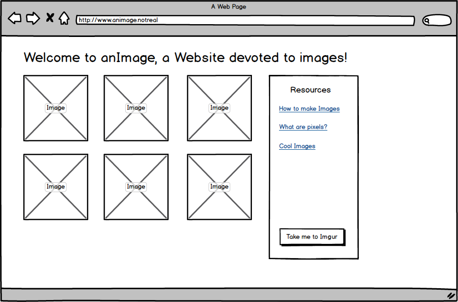
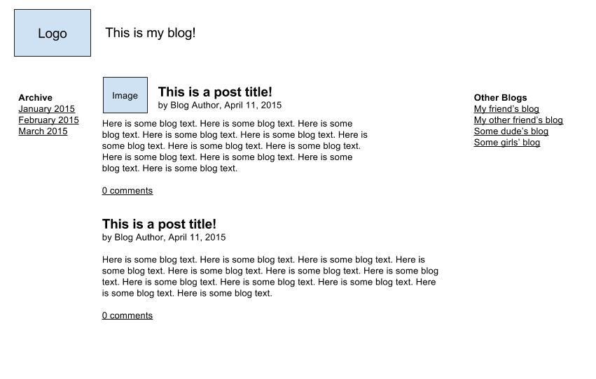
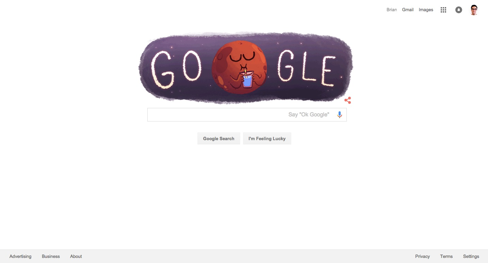
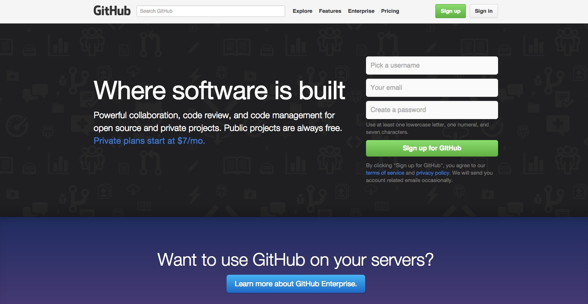

## Mockups Lab

For today's lab, we'd like you to code up the mockups using HTML/CSS.

## Getting Started

1. For each mockup, create a new HTML page. Make sure to include the appropriate elements (DOCTYPE, html tags, head tags) before starting the body.
2. Use http://lorempixel.com if you need a placeholder for images. Or other image sites.

## If you get stuck....

1. Review the notes from today's lecture
2. Check out MDN's documentation for both [HTML](https://developer.mozilla.org/en-US/docs/Web/HTML) and [CSS](https://developer.mozilla.org/en-US/docs/Web/CSS/Reference). Also, use Google if you come across a problem that "seems" unfixable.

## Mockups

* Mockup 1

* Mockup 2

## Bonus

* Make a mockup of [Google](https://www.google.com/)

* Make a mockup of [Github](https://www.github.com).

